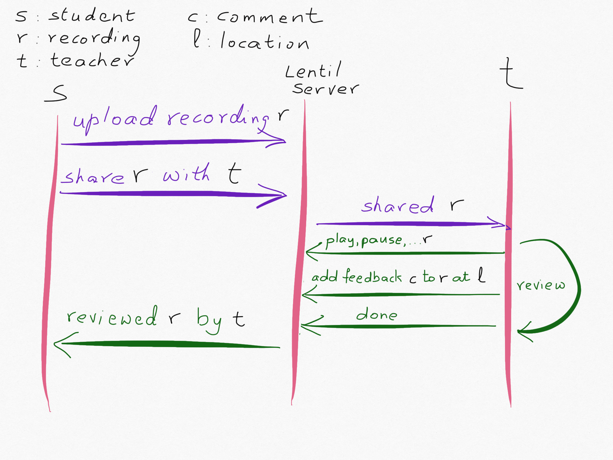

# lentil

A musician's feedback service. I keep some notes on this project on my blog at https://ashdza.github.io/blog/.

## Overview

Musicians submit recordings of performances and receive pointed feedback from other musicians. I am implementing the front-end of this service with ReasonML + React, and will use Hasura's GraphQL server with a Postgres database for the back-end.

The core idea is summarized by this interaction:



## Demo

I keep a running demo of a current version of this app at 
https://lentil.7insights.com.

I currently  use an existing React component over SoundCloud for the audio player, and when paused, the player sometimes overlays an ad. You need to close out that overlay to continue with the player.

## Code Overview

The code is best read in the following order:

```
Types.re
Song.re
App.re
```

Only the top-level App is a *stateful* Reason-React component, implemented as a ReasonML module (the entire `App.re` file is a module) with its own `make` function that defines:

- some `initialState` for when a new App instance starts
- a `reducer` function to update that state based on an `action`
- a `render` function to create the html from current state.

All other functions (e.g. in `Song.re`) are stateless, so I implemented them as simple functions without the unnecessary overhead of wrapping them in Reason-React *stateless* components, and passed in updater callbacks from `App` when needed. 


## Run Project

After cloning this repository:

```sh
npm install
npm start
```
